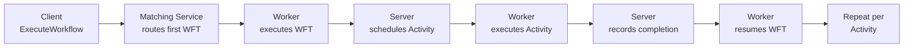

# Performance & Latency Patterns

> For the complete documentation index, see [llms.txt](https://docs.temporal.io/llms.txt).
> Any documentation page is available as raw Markdown by appending `.md` to its URL.

> Pattern selection guide for reducing Workflow latency, with a comparison of the round-trips each pattern removes and their combined effect.

Temporal Workflows are durable and reliable, but a default implementation—using regular Activities scheduled through the Temporal server—carries inherent latency. Each regular Activity incurs multiple server round-trips, and each new Workflow begins with a Matching Service routing step. On Temporal Cloud, this baseline can reach 850 ms or more for a typical three-Activity workflow.

This section covers three complementary patterns that each target a different source of latency. They can be applied individually or combined depending on your requirements.

## Latency sources in a typical Workflow

| Source | Overhead | Pattern that removes it |
|---|---|---|
| Matching Service (first Workflow Task) | ~30–50 ms | [Eager Workflow Start](/design-patterns/eager-workflow-start) |
| Activity scheduling round-trip | ~50 ms per Activity | [Local Activities](/design-patterns/local-activities) |
| Client waiting for full workflow | Total duration | [Early Return](/design-patterns/early-return) |

## Pattern comparison

The numbers below are approximate benchmarks based on a three-Activity transaction workflow running on Temporal Cloud. Actual results vary by region, Activity implementation, and server load.

| Pattern | First Response | Total Latency | SDK Support |
|---|---|---|---|
| Baseline (regular Activities) | ~850 ms | ~850 ms | All |
| [Early Return](/design-patterns/early-return) | ~265 ms | ~850 ms | All |
| [Local Activities](/design-patterns/local-activities) | ~275 ms | ~275 ms | All |
| [Early Return + Local Activities](/design-patterns/early-return-local-activities) | ~160 ms | ~275 ms | All |
| [Eager Workflow Start](/design-patterns/eager-workflow-start) + Local Activities | ~265 ms | ~265 ms | Go, Java, Python, TypeScript, .NET |
| Early Return + Local Activities + Eager Start | ~160 ms | ~265 ms | Go, Java, Python, TypeScript, .NET |

**First Response** is the time until the client receives an actionable result. **Total Latency** is the time until the Workflow fully completes.

## Patterns in this section

- [Local Activities](/design-patterns/local-activities): Local Activities run inside the Worker process, skipping server round-trips for short, idempotent Activities on a latency-sensitive path.
- [Early Return + Local Activities](/design-patterns/early-return-local-activities): Extends Early Return by running Phase 1 as Local Activities, so the client's first response comes from in-process work, not a server call.
- [Eager Workflow Start](/design-patterns/eager-workflow-start): Eager Workflow Start sends the first Workflow Task directly to a co-located Worker, skipping the Matching Service to cut startup latency.

## Choosing a pattern

**You only care about total workflow latency** (not first-response time): use [Local Activities](/design-patterns/local-activities). If co-location is feasible, add [Eager Workflow Start](/design-patterns/eager-workflow-start) for the maximum reduction.

**You care most about first-response latency**: use [Early Return + Local Activities](/design-patterns/early-return-local-activities). The client gets its response in ~160 ms; background work continues independently.

**You want to start simple**: begin with [Local Activities](/design-patterns/local-activities). It requires minimal structural change and provides the most straightforward per-Activity improvement.

## Related sections

- [Distributed Transaction Patterns](/design-patterns/distributed-transaction-patterns) — the [Early Return](/design-patterns/early-return) pattern lives there, describing the Update-with-Start mechanism in detail
- [Worker Configuration Patterns](/design-patterns/worker-configuration-patterns) — tuning Worker concurrency and task queue assignments that affect throughput
- [QoS & Throughput Patterns](/design-patterns/qos-throughput-patterns) — rate limiting and fairness patterns for high-volume workloads
